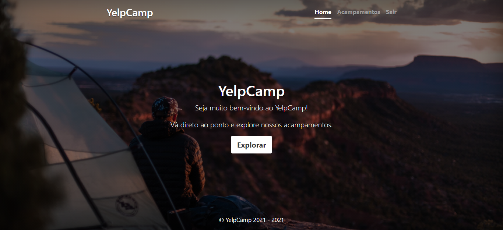
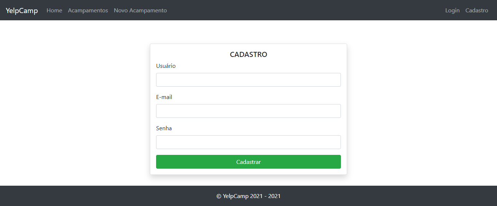
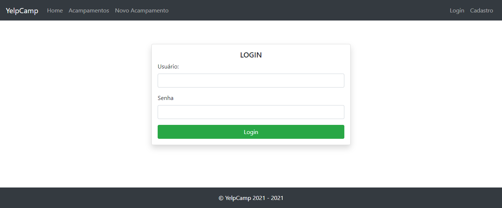
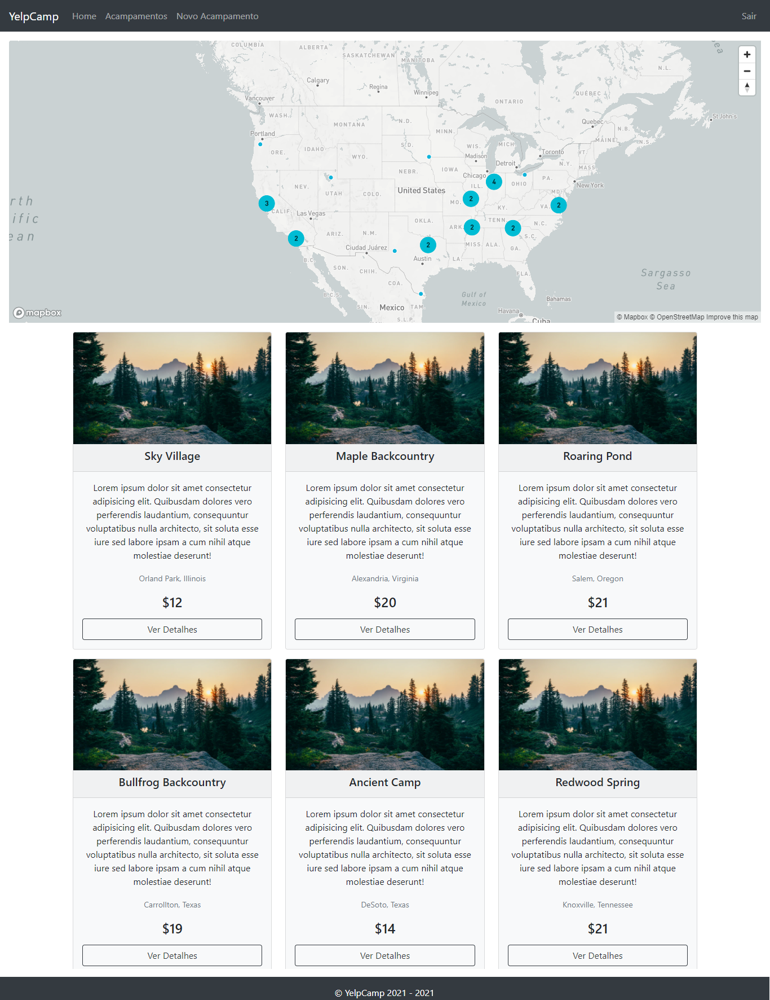
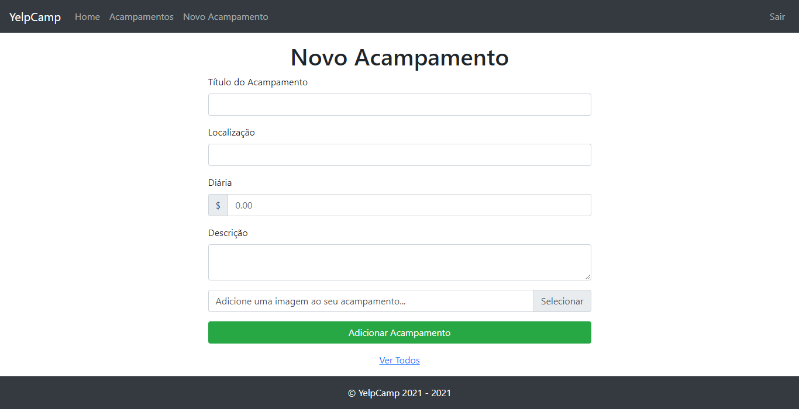
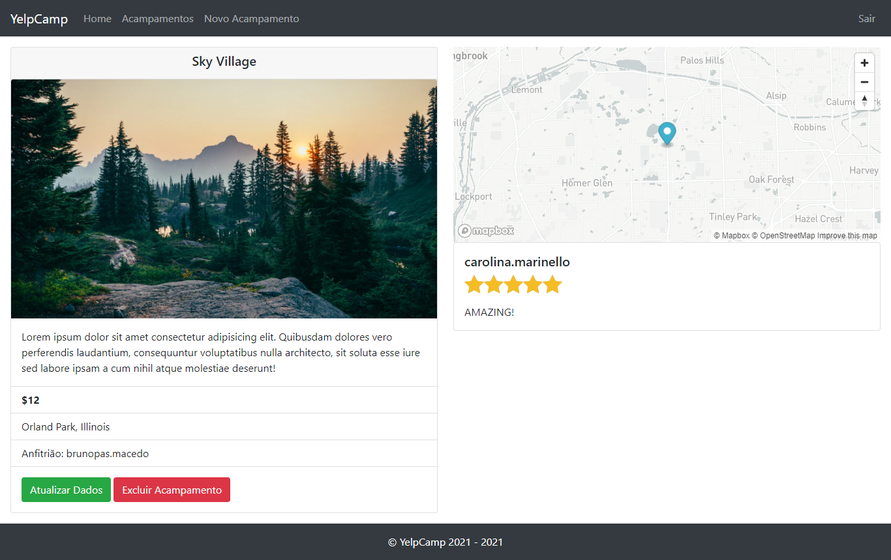
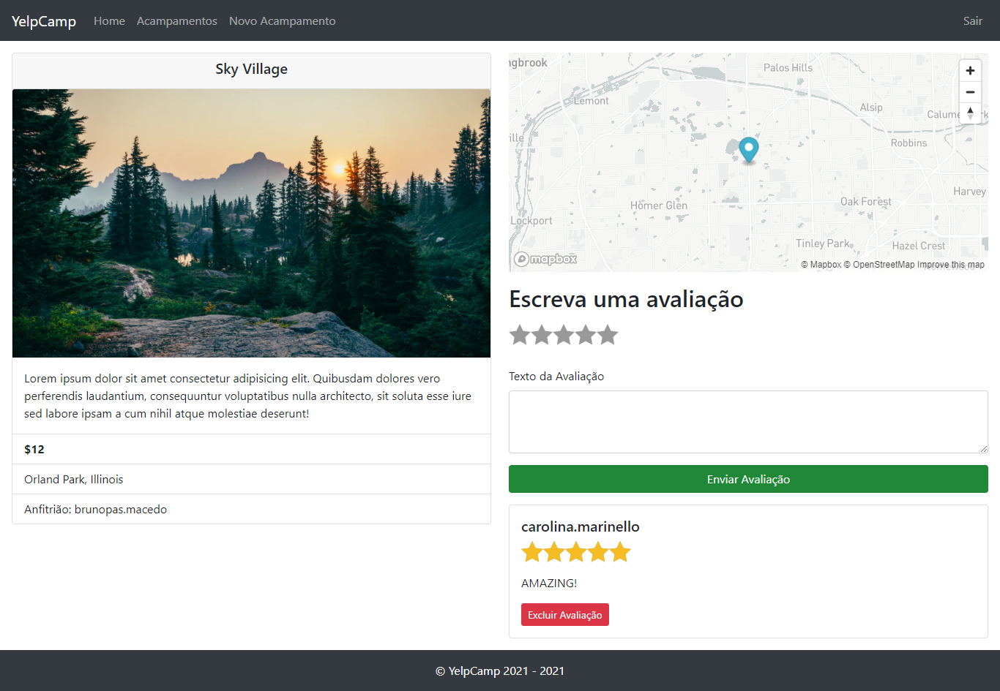
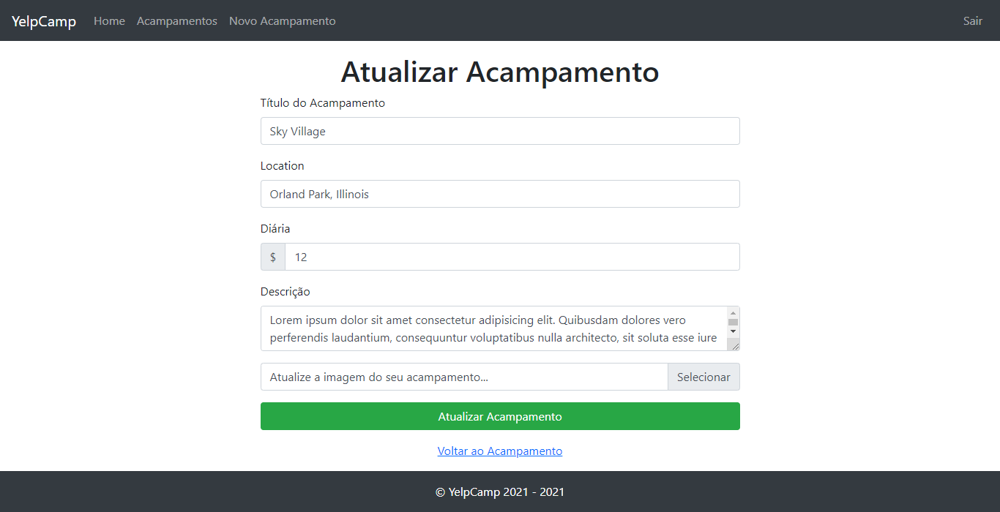

<h1 align="center">
    
</h1>

<h4 align="center"> 
	🚧  YelpCamp 🚀 Concluído 🚧
</h4>

<p align="center">
 <a href="#-sobre">Sobre</a> •
 <a href="#-funcionalidades">Funcionalidades</a> •
 <a href="#-layout">Layout</a> • 
 <a href="#-como-executar">Como Executar</a> • 
 <a href="#-tecnologias">Tecnologias</a> • 
 <a href="#-autor">Autor</a> • 
 <a href="#user-content--licença">Licença</a>
</p>


## 💻 Sobre
O YelpCamp é uma aplicação similar ao famoso Yelp, mas com foco exclusivo em acampamentos (campgrounds). É possível explorar os acampamentos, cadastrar novos acampamentos, adicionar e excluir avaliações, sendo que a maioria das funções necessitam de um cadastro / login.

Projeto desenvolvido durante o **The Web Developer Bootcamp 2021** oferecido pelo [Colt Steele By Udemy](https://www.udemy.com/course/the-web-developer-bootcamp/).

---

## ⚙️ Funcionalidades

- Mapas dos Acampamentos (Localização)
- Login e Cadastro
- Cadastrar / Atualizar Acampamentos
- Visualizar Acampamentos
- Excluir Acampamentos
- Avaliar Acampamentos / Excluir Avaliações

---

## 🎨 Layout

<p align="center"><b>Home</b></>

<p align="center"><b>Cadastro</b></>

<p align="center"><b>Login</b></>

<p align="center"><b>Acampamentos</b></>

<p align="center"><b>Novo Acampamento</b></>

<p align="center"><b>Visualizar Acampamento (cadastrado por mim)</b></>

<p align="center"><b>Visualizar Acampamento (cadastrado por outra pessoa)</b></>

<p align="center"><b>Editar Acampamento</b></>


---

## 🚀 Como Executar

Antes de começar, você vai precisar ter instalado em sua máquina as seguintes ferramentas:
[Git](https://git-scm.com), [Node.js](https://nodejs.org/en/). 
Além disto é bom ter um editor para trabalhar com o código como [VSCode](https://code.visualstudio.com/)

```bash

# Clone este repositório
$ git clone https://github.com/brunopas/yelpcamp.git

# Acesse a pasta do projeto pelo terminal
$ cd yelpcamp

# Vá para a pasta "src"
$ cd src

# Instale as dependências
$ npm install

# Execute o script do banco de dados
$ npm run seeds

# Execute a aplicação em modo de desenvolvimento
$ npm run dev

# O servidor inciará na porta:3000 (http://localhost:3333)

```

---

## 🛠 Tecnologias

As seguintes tecnologias e ferramentas foram usadas na construção do projeto:

- HTML
- CSS
- Javascript
- **[NodeJS](https://nodejs.org/en/)**
- **[Express](https://expressjs.com/)**
- **[EJS](https://ejs.co/)**
- **[MongoDB](https://www.mongodb.com/)**
- **[Mongoose](https://mongoosejs.com/)**
- **[Passport](https://www.npmjs.com/package/passport)**
- **[Multer](https://www.npmjs.com/package/multer)**
- **[Helmet](https://www.npmjs.com/package/helmet)**

> Veja o arquivo [package.json](https://github.com/brunopas/jobscalc/blob/main/package.json)

---

## 💪 Como contribuir para o projeto

1. Faça um **fork** do projeto.
2. Crie uma nova branch com as suas alterações: `git checkout -b my-feature`
3. Salve as alterações e crie uma mensagem de commit contando o que você fez: `git commit -m "feature: My new feature"`
4. Envie as suas alterações: `git push origin my-feature`
> Caso tenha alguma dúvida confira este [guia de como contribuir no GitHub](./CONTRIBUTING.md)

---

## 🦸 Autor

<a href="https://www.linkedin.com/in/brunopasmacedo/"></a>
<br />
<a href="https://www.linkedin.com/in/brunopasmacedo/" title="Bruno Pasquarelli Macedo"><b>Bruno Pasquarelli Macedo</b></a> 🚀<br />
[](https://www.linkedin.com/in/brunopasmacedo/) 
[](https://github.com/brunopas)

---

## 📝 Licença

Este projeto está sob a licença [MIT](./LICENSE).

Feito com ❤️ por Bruno Macedo 👋🏽 [Entre em contato!](https://www.linkedin.com/in/brunopasmacedo/)
